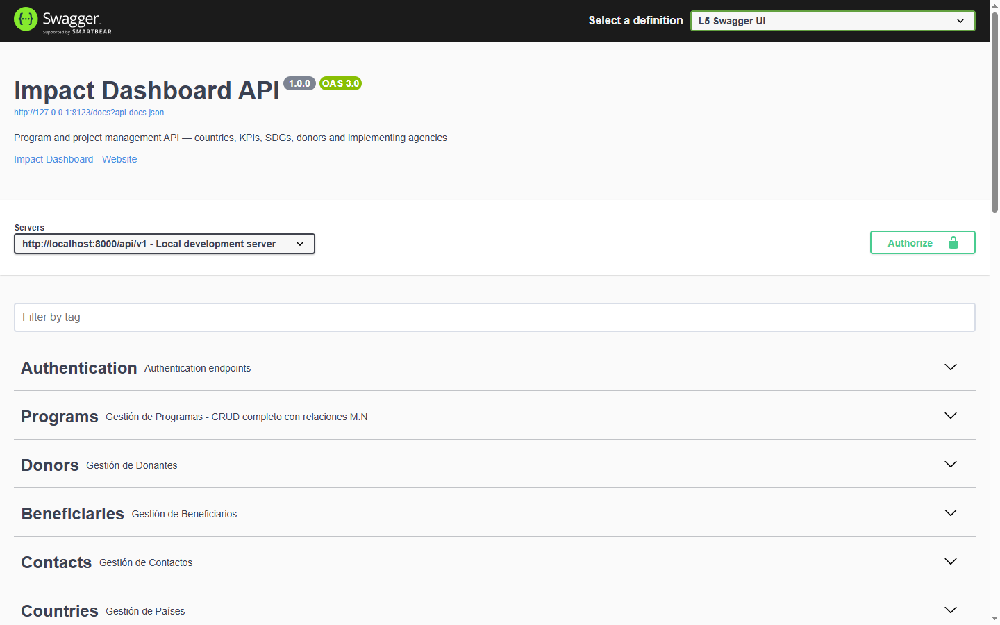
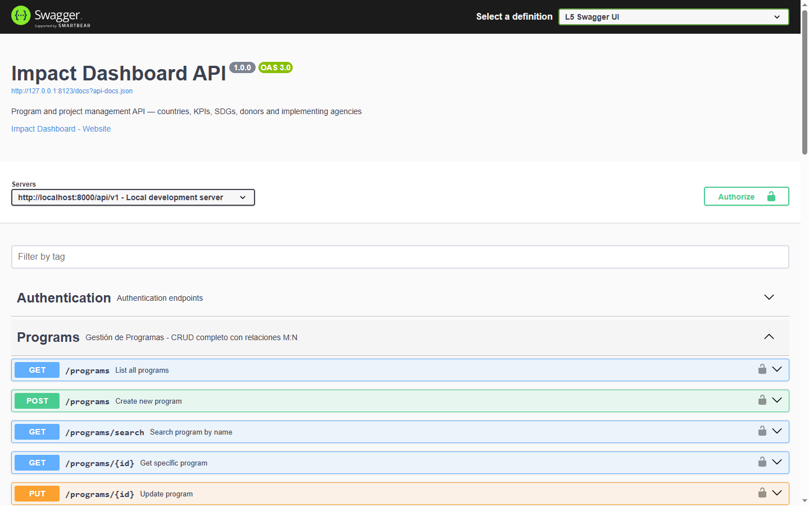
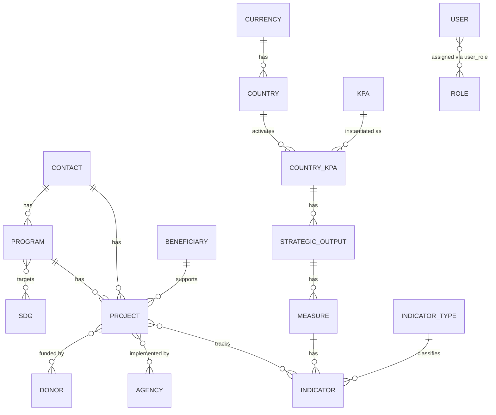

# Impact Dashboard — Backend API

[](https://github.com/dev-kevzeb/impact-dashboard-api/actions/workflows/tests.yml)
[](./LICENSE)
[](https://www.php.net/)
[](https://laravel.com/)
[](https://www.postgresql.org/)
[](https://jwt.io/)

A versioned REST API for managing development-cooperation programs, projects, KPIs and SDGs across countries, donors and implementing agencies — built with Laravel 12 and a modular, domain-driven architecture.

This is the backend API behind **[Impact Dashboard](https://github.com/dev-kevzeb/impact-dashboard)** — see that repository for the frontend source and live demo. Every request/response contract the frontend integrates against was designed and implemented here.

| | |
|---|---|
| **34** domain modules | **229** API endpoints |
| **71** test files (Unit + Feature) | Full OpenAPI/Swagger docs |

## Features

- Versioned API (`/api/v1`) with JWT authentication and per-module permission scopes
- Modular architecture organized by domain (`Controller -> Service -> Repository -> Domain`), not generic technical layers
- Role-based access control via `spatie/laravel-permission`, with `scope:{module}` / `scope:{module}:write` middleware and a global `*:*` scope for admin profiles
- Hierarchical KPI tracking (KPA → Strategic Output → Measure → Indicator) mapped against UN Sustainable Development Goals
- Public, unauthenticated endpoints (`/api/v1/public/*`) for embeddable dashboards and regional statistics
- Full OpenAPI/Swagger documentation, generated from code
- Email verification and reCAPTCHA-protected registration

## API documentation (Swagger/OpenAPI)

Every endpoint is documented from code via OpenAPI annotations — grouped by resource, with request/response schemas and JWT bearer auth wired in.

| | |
|---|---|
|  |  |
| **Overview** — 28 tagged resource groups covering the full domain | **Programs** — one of 34 modules, each with full CRUD + search |

```bash
php artisan l5-swagger:generate
```

Default routes:

- UI: `/api/documentation`
- JSON: `/docs` (generated into `storage/api-docs`)

## Tech stack

| Category | Stack |
|---|---|
| Core | PHP `^8.2`, Laravel Framework `^12.0`, PostgreSQL (production), SQLite in-memory (testing) |
| Auth & access | JWT via `php-open-source-saver/jwt-auth` (`^2.8`), roles/permissions via `spatie/laravel-permission` (`^6.24`), per-module scope middleware |
| API docs | Swagger/OpenAPI via `darkaonline/l5-swagger` (`^9.0`) |
| Mail | Laravel Notifications (`MustVerifyEmail`), SMTP-configurable transport; `symfony/mailgun-mailer` available for Mailgun integration |
| Dev tooling | Tinker, Pint (code style), PHPUnit (`^11.5`), Mockery, Collision, Pail, Sail |

## Architecture

Pattern per module: `Controller -> Service -> Repository -> Domain`

```
app/
└─ Modules/
   └─ {Entity}/            # one folder per domain entity, e.g. Program, Project, KPA
      ├─ Controller/         #   HTTP layer — request in, ApiResponse out
      ├─ Service/            #   business rules, orchestration
      ├─ Repository/         #   query layer, Eloquent-facing
      └─ Domain/             #   domain objects, value rules
```

Key conventions:

- Tables named in singular.
- API routes versioned under `/api/v1/*`.
- Technical validation lives in `FormRequest` classes.
- Business-rule validation lives in `Domain`/`Service`.
- Standardized JSON response shape: `success`, `message`, `data`.

## Design highlights

- **Per-module permission scopes, not just roles** — access is granted as `scope:{module}` / `scope:{module}:write` pairs (e.g. `scope:programs:write`), composed per user rather than hard-coded into a fixed set of role names. A new access profile is just a new combination of existing scopes, no code change required.
- **Hierarchical KPI model, not a flat metrics table** — indicators roll up through KPA → Strategic Output → Measure → Indicator, each level mapped against UN Sustainable Development Goals. One rollup model serves every dashboard level (KPA-wide down to a single indicator) instead of duplicating aggregation logic per screen.
- **A separate public API surface, not permissive CORS on the private one** — `/api/v1/public/*` is its own unauthenticated route group with dedicated controllers, built for the embeddable public site and regional statistics. Public consumers never touch the same endpoints or serializers as the authenticated app.
- **The same four-layer shape in every module** — `Controller -> Service -> Repository -> Domain` is enforced consistently across all 34 modules, so business rules live in `Service`/`Domain`, never in controllers or Eloquent models. That consistency is what keeps 71 test files tractable to maintain at this module count.

## Data model

The schema has 35 tables. This is the core business domain — country/program-scoped role-assignment and invitation tables, plus status/catalog lookups, are omitted here for readability (see `database/migrations/` for the full schema).



## API & Authentication

Base paths:

- Authenticated: `/api/v1/*`
- Public: `/api/v1/public/*`

JWT flow:

1. `POST /api/v1/auth/login`
2. Send the token as a `Bearer` header on authenticated requests
3. `POST /api/v1/auth/refresh` to renew the token
4. `GET /api/v1/auth/me` to fetch the authenticated user

Access control:

- `jwt` middleware protects private routes.
- `scope:*` middleware gates permissions per module.
- A global `*:*` scope supports admin profiles.

## Getting started

### Requirements

- PHP 8.2+
- Composer
- Node.js 18+ and npm
- PostgreSQL

### Setup

```bash
composer install                # install dependencies
cp .env-example .env            # copy the environment template
php artisan key:generate        # generate APP_KEY
php artisan jwt:secret          # generate JWT_SECRET
php artisan migrate --seed      # run migrations and seeders
```

### Scripts

```bash
composer dev              # Laravel server + queue listener + Vite, in parallel
php artisan serve         # server only
php artisan migrate       # run migrations
php artisan migrate --seed
php artisan optimize:clear
php artisan route:list
./vendor/bin/pint         # code style
```

## Environment variables

Review these before running in any environment (see `.env-example` for the full template with placeholder values).

| Group | Variables |
|---|---|
| App & CORS | `APP_ENV`, `APP_DEBUG` (must be `false` in production), `APP_URL`, `FRONTEND_URL` |
| Database | `DB_CONNECTION`, `DB_HOST`, `DB_PORT`, `DB_DATABASE`, `DB_USERNAME`, `DB_PASSWORD` |
| JWT | `JWT_SECRET`, `JWT_TTL`, `JWT_REFRESH_TTL`, `JWT_ALGO`, `JWT_BLACKLIST_ENABLED` |
| Mail | `MAIL_MAILER`, `MAIL_HOST`, `MAIL_PORT`, `MAIL_USERNAME`, `MAIL_PASSWORD`, `MAIL_ENCRYPTION`, `MAIL_FROM_ADDRESS`, `MAIL_FROM_NAME` |
| reCAPTCHA v2 (registration) | `RECAPTCHA_SITE_KEY` (public, safe for the frontend), `RECAPTCHA_SECRET_KEY` (sensitive), `RECAPTCHA_EXPECTED_HOSTNAME` (optional, recommended in staging/production) |

## Testing

PHPUnit with `Unit` and `Feature` suites.

Test environment: `APP_ENV=testing`, `DB_CONNECTION=sqlite`, `DB_DATABASE=:memory:`

```bash
composer test                                              # all tests
php artisan test tests/Feature/AuthRegisterWithCountryTest.php  # a single file
php artisan test --testsuite=Feature
php artisan test --testsuite=Unit
```

## Public files & uploads

To expose `storage/app/public` at `public/storage`:

```bash
php artisan storage:link
```

## Production checklist

Before release:

1. `APP_ENV=production`
2. `APP_DEBUG=false`
3. Secrets loaded from a secure environment, not the repo
4. Sensitive variables generated with strong randomness
5. Migrations applied
6. `php artisan storage:link` run
7. Swagger regenerated
8. Outbound mail verified

Recommended deploy commands:

```bash
composer install --no-dev --optimize-autoloader
php artisan migrate --force
php artisan config:cache
php artisan route:cache
php artisan view:cache
php artisan l5-swagger:generate
```

## Security

- Real secrets live only in a local, gitignored `.env` — `.env-example` documents every required key with placeholder values, never live credentials.
- Rotate any secret that is ever exposed, before production use.
- Use distinct credentials per environment (`local`, `staging`, `production`).
- Keep `RECAPTCHA_SECRET_KEY` only in secure environment variables.
- Review JWT scopes and role permissions periodically.

## License

MIT — see [LICENSE](./LICENSE).
